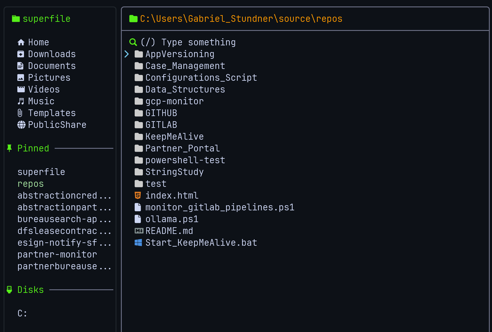

# My Superfile Version

- Thanks to []() for the amazing project [superfile]().

## Description

- This project is the directory with my configuration to superfile (theme, configs, hotkeys).
- The idea is when I use any OS and Terminal I will going to use this version.

## Installation

- Run the following command into any Operational System:

```bash

```

## File Locations

### Windows

- Clone this repository into the `C:\Users\{your-user}\AppData\Local\`.
- Change the name of the repository to `superfile`.
- Run the project with `spf` command.

### Linux

- Clone this repository into the `~/.config/`.
- Change the name of the repository to `superfile`.
- Run the project with `spf` command.

### MacOSX

- TBD

## Colors

- Base border: #21262d
- Border active: #6c7086
- Project background color: #0d1117
- Project Foreground color: #cdd6f4
- Icons and Sidebar tittles: #56EF19
- Current folder location: #FE9900
- Sidebar selected directory foreground: #a6e3a1
- Sidebar selected directory background: #0d1117
- Cursor color to move between files/dirs: #74c7ec


